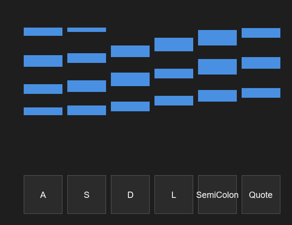
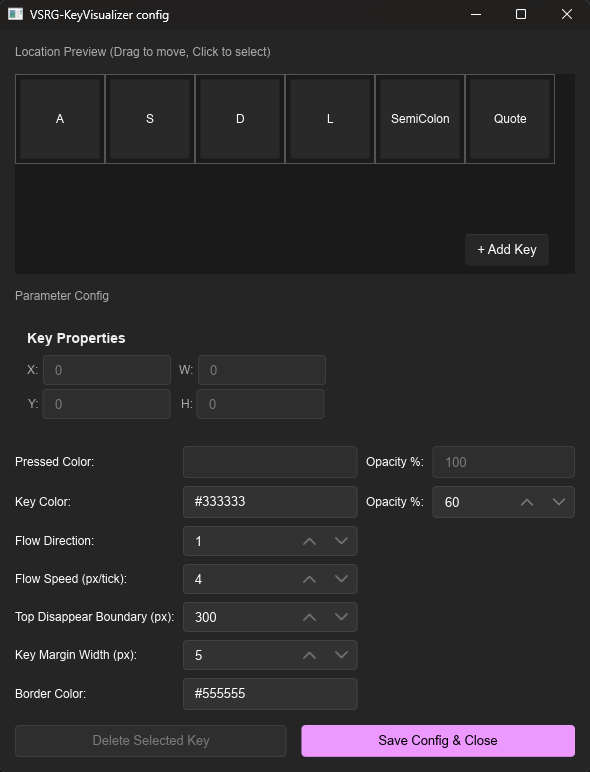

English|[中文](README.md)
---
# VSRG-KeyVisualizer






VSRG-KeyVisualizer is a lightweight, real-time keyboard key display tool designed to provide intuitive key visualization feedback for VSRG (Vertical Scrolling Rhythm Games) players. 
## Project Status
Currently, it only supports Windows.
Double-click the main window to open the configuration interface, and right-click to close the application!!!
There are still some bugs, but it is basically functional. More features will be added in the future.
## Introduction
Whether you are live streaming, recording videos, or just practicing, VSRG-KeyVisualizer can capture and display your keyboard inputs in real-time, helping your audience or yourself observe the keypress process more clearly. This project is written in **Rust** and developed using the **Slint** UI framework, featuring high performance and low resource usage.
## Key Features
* **Real-time Performance**: Built with Rust, ensuring imperceptible latency between key triggers and display.
* **Lightweight**: Extremely low system resource usage, ensuring it won't affect your gameplay performance.
* **UI Framework**: Uses Slint UI, providing a clean and easily customizable interface.
* **Open Source License**: This project is released under the GNU GPLv3 open-source license.
## Tech Stack
* **Core Language**: Rust
* **UI Framework**: Slint
## Getting Started
### Prerequisites
Before compiling or running this project, please ensure your system has the following installed:
* [Rust programming environment](https://www.rust-lang.org/tools/install) (including Cargo)
### Build and Run
1. Clone the repository to your local machine:
```bash
git clone https://github.com/lixiaapp/VSRG-KeyVisualizer.git
cd VSRG-KeyVisualizer
```
2. Run the project:
```bash
cargo run
```
## Configuration
You can customize the layout and style of the key display through the `config.json` file in the root directory (please adjust according to the actual configuration items of the project).
## License
This project is distributed under the **GNU General Public License v3.0 (GPLv3)**. This means:
* You are free to use, modify, and distribute this software.
* If you modify the code and distribute it, your derivative works must also be open-sourced under the GPLv3 license.
For details, please refer to the [LICENSE](LICENSE) file.
