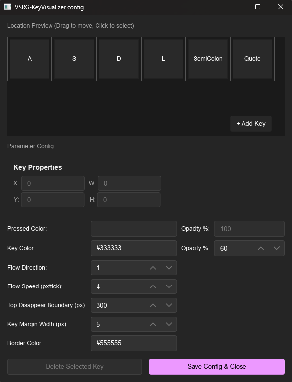
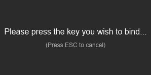

[English](README-EN.md)|中文
---
# VSRG-KeyVisualizer

<table>
  <tr>
    <td align="center"><br>主窗口</td>
    <td align="center"><br>配置窗口</td>
    <td align="center"><br>新增按键</td>
  </tr>
</table>

VSRG-KeyVisualizer 是一个轻量级、实时键盘按键显示工具，旨在为音游（VSRG）玩家提供直观的按键可视化反馈。

## 项目状态

目前只支持 Windows 系统。

主窗口支持**鼠标拖拽**、**双击打开配置**、**右键菜单**（打开配置/关闭）。

仍有改进空间，但基本可用。

## 主要特性

* **实时性能**：基于 Rust 和原生 Windows Raw Input 构建，60fps 流畅渲染。
* **按键可视化**：瀑布流动画效果，自定义按键布局、颜色、大小和透明度。
* **灵活配置**：图形化配置窗口，支持 Drag & Drop 调整按键位置。
* **多选编辑**：Ctrl+点击多选按键，批量移动/调整大小/颜色/透明度/瀑布流宽度。
* **物理吸附**：拖拽按键时自动对齐，碰撞避免重叠。
* **透明窗口**：主窗口背景透明，点击穿透，不影响游戏操作。
* **轻量级**：系统资源占用极低，不影响游戏表现。

## 技术栈

* **核心语言**: Rust
* **UI 框架**: Slint 1.16
* **输入捕获**: Windows Raw Input API（低延迟键盘钩子）
* **窗口管理**: winit 窗口系统

## 快速开始

### 前置要求

确保已安装 [Rust 编程环境](https://www.rust-lang.org/tools/install) (包括 Cargo)。

### 编译运行

```bash
git clone https://github.com/lixiaapp/VSRG-KeyVisualizer.git
cd VSRG-KeyVisualizer
cargo run --release
```

## 使用说明

### 主窗口
- **鼠标左键拖拽**：移动窗口位置
- **鼠标双击**：打开配置窗口
- **鼠标右键**：弹出菜单（打开配置 / 关闭应用）

### 配置窗口
- **画布拖拽**：拖拽按键调整位置（支持磁吸对齐）
- **Ctrl+点击**：多选按键
- **右侧面板**：修改 X/Y 坐标、宽度/高度、激发颜色、透明度、瀑布流宽度百分比
- **多选编辑**：选中的按键可批量修改上述属性
- **Delete 键 / 按钮**：删除选中按键（带确认弹窗，Enter 确认，ESC 取消）
- **+ Add Key**：添加新按键（按下键盘任意键绑定）

### 配置说明

配置保存在 `config.json` 中，包含按键布局、颜色、瀑布流方向与速度等参数。可通过配置窗口图形化调整。

## 开源协议

本项目采用 **GNU General Public License v3.0 (GPLv3)** 协议进行分发。

详情请参阅 [LICENSE](LICENSE) 文件。